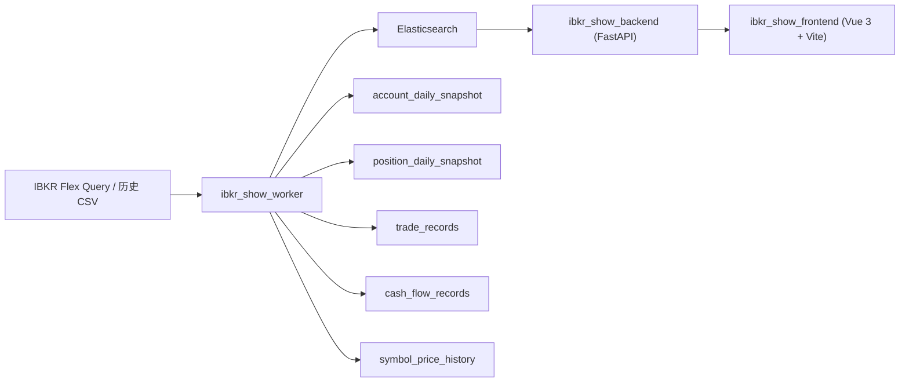
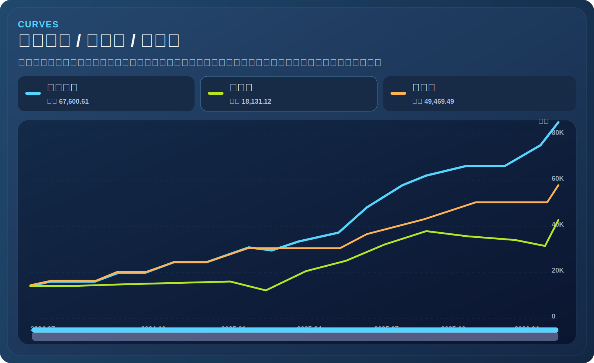

# IBKR Show

`IBKR Show` 是一个面向个人 IBKR 账户的可视化分析项目。

它做的事情很直接：

- 从 IBKR Flex Query 拉取 `MyDailyData`
- 解析历史快照和每日增量
- 幂等写入 Elasticsearch
- 通过 FastAPI 提供查询接口
- 通过 Vue 前端展示账户权益、持仓、交易、出入金和股票详情

这个仓库已经整理成“拉下代码后只需要补 IBKR 配置即可运行”的结构。默认前提是：

- 你本机已经有一个可用的 Elasticsearch，地址默认是 `http://localhost:9200`
- 你可以从 IBKR 导出历史快照 CSV，或者已经配置好 Flex Token 与 Daily Query ID

业务上真正必须手动填写的核心配置只有：

- `FLEX_TOKEN`
- `FLEX_QUERY_ID_DAILY`

历史数据则通过导出的 CSV 批量导入。

## 项目能力

当前项目支持：

- 账户总览
  - 总权益、现金、股票市值、已实现盈亏、未实现盈亏、总盈亏、TWR
- 账户曲线
  - 账户权益
  - 净收益
  - 净成本
- 持仓明细
  - 数量、持仓均价、市价、持仓市值、占比
  - 日涨跌
  - 已实现 / 未实现盈亏及百分比
- 股票详情
  - 历史价格 K 线
  - 买点 / 卖点标记
  - 每笔买卖数量
- 交易记录
  - 按日期、代码、方向筛选
  - 表头排序
  - 按币种展示成交净额
- 出入金记录
  - 按日期、币种、方向筛选
  - 按币种统计累计入金、累计出金和净流入

## 仓库结构

- `ibkr_show_worker`
  - 负责 IBKR Flex 拉取、CSV 解析、ETL、写入 Elasticsearch
- `ibkr_show_backend`
  - FastAPI 查询层
- `ibkr_show_frontend`
  - Vue 3 + Vite 前端
- `ibkr_show_common`
  - 预留的共享文档、常量、schema 与 prompts 目录

## 数据链路

```text
IBKR Flex Query / 历史 CSV
    -> worker 解析
    -> Elasticsearch
    -> backend API
    -> frontend 页面
```

## 系统架构



## 页面预览



当前会写入 5 个业务索引：

- `ibkr_account_daily_snapshot_v1`
  - 账户级日快照
- `ibkr_position_daily_snapshot_v1`
  - 持仓级快照
- `ibkr_trade_records_v1`
  - 交易流水
- `ibkr_cash_flow_records_v1`
  - 出入金流水
- `ibkr_symbol_price_history_v1`
  - 标的历史价格序列，用于股票详情 K 线

## 运行前准备

建议环境：

- Python `3.11+`
- Node.js `18+`
- npm `9+`
- Elasticsearch `8.x`

默认端口：

- Elasticsearch: `9200`
- Backend: `8000`
- Frontend: `5173`

## 快速开始

### 1. 克隆仓库

```bash
git clone <your-github-url> ibkr_show
cd ibkr_show
```

### 2. 安装依赖

#### Worker

```bash
cd /path/to/ibkr_show/ibkr_show_worker
python3 -m venv .venv
source .venv/bin/activate
pip install -r requirements.txt
```

#### Backend

```bash
cd /path/to/ibkr_show/ibkr_show_backend
python3 -m venv .venv
source .venv/bin/activate
pip install -r requirements.txt
```

#### Frontend

```bash
cd /path/to/ibkr_show/ibkr_show_frontend
npm install
```

### 3. 配置环境变量

#### Worker

```bash
cd /path/to/ibkr_show/ibkr_show_worker
cp .env.example .env
```

最少需要确认：

```env
FLEX_TOKEN=你的_ibkr_flex_token
FLEX_QUERY_ID_DAILY=你的_daily_query_id
ES_HOST=http://localhost:9200
```

其余参数默认值通常可以直接使用。

#### Backend

```bash
cd /path/to/ibkr_show/ibkr_show_backend
cp .env.example .env
```

如果 Elasticsearch 就是本机默认地址，通常不需要改动；默认值已经对齐当前项目索引名。

### 4. 初始化 Elasticsearch 索引

```bash
cd /path/to/ibkr_show/ibkr_show_worker
./.venv/bin/python -m worker.main init-es
./.venv/bin/python -m worker.main es-health
```

### 5. 导入历史快照

如果你的历史文件都在一个目录里，例如：

```text
/Users/you/Downloads/历史快照
```

可以批量导入：

```bash
cd /path/to/ibkr_show/ibkr_show_worker
find /Users/you/Downloads/历史快照 -name '*.csv' -print0 | while IFS= read -r -d '' file; do
  echo "importing $file"
  ./.venv/bin/python -m worker.main import-daily-file --file "$file"
done
```

如果只导入单个文件：

```bash
./.venv/bin/python -m worker.main import-daily-file --file /absolute/path/to/history.csv
```

### 6. 启动后端

```bash
cd /path/to/ibkr_show/ibkr_show_backend
./.venv/bin/uvicorn app.main:app --host 127.0.0.1 --port 8000
```

### 7. 启动前端

```bash
cd /path/to/ibkr_show/ibkr_show_frontend
npm run dev -- --host 127.0.0.1 --port 5173
```

### 8. 可选：启动每日增量调度

如果你已经配置好了 `FLEX_TOKEN` 和 `FLEX_QUERY_ID_DAILY`，可以开启每日自动增量：

```bash
cd /path/to/ibkr_show/ibkr_show_worker
./.venv/bin/python -m worker.main run-scheduler
```

当前默认调度规则：

- 每天北京时间 `09:00`
- 拉取一次 `MyDailyData`
- 幂等写入 ES

也可以手动执行一次：

```bash
./.venv/bin/python -m worker.main pull-daily-from-ibkr
```

## 启动后访问

- 前端: [http://127.0.0.1:5173](http://127.0.0.1:5173)
- 后端健康检查: [http://127.0.0.1:8000/health](http://127.0.0.1:8000/health)

## 当前页面说明

- `/`
  - 总览页，展示账户摘要、权益曲线、关键指标
- `/positions`
  - 持仓页，展示持仓明细、集中度、行业和资金类别
  - 点击持仓行可打开股票详情弹窗
- `/trades`
  - 交易页，展示交易筛选、汇总卡片、交易明细
- `/cash-flows`
  - 出入金页，展示出入金筛选、按币种汇总和明细表

## 股票详情页的数据口径

股票详情弹窗使用：

- `ibkr_symbol_price_history_v1`
  - 作为历史价格主数据源
- `ibkr_trade_records_v1`
  - 叠加买点 / 卖点和成交数量

因此：

- K 线来源于历史快照中的价格历史 section
- 买卖点来自真实交易记录

## 常用命令

### Worker

```bash
./.venv/bin/python -m worker.main init-es
./.venv/bin/python -m worker.main es-health
./.venv/bin/python -m worker.main import-daily-file --file /absolute/path/to/file.csv
./.venv/bin/python -m worker.main pull-daily-from-ibkr
./.venv/bin/python -m worker.main run-scheduler
```

### Backend

```bash
./.venv/bin/uvicorn app.main:app --host 127.0.0.1 --port 8000
```

### Frontend

```bash
npm run dev -- --host 127.0.0.1 --port 5173
npm run build
```

## 常见问题

### 1. 为什么页面没有数据？

先确认：

- Elasticsearch 已启动
- 已执行 `init-es`
- 已导入历史 CSV 或执行过 `pull-daily-from-ibkr`
- Backend `.env` 中 `ES_*` 配置可访问当前 ES

### 2. 为什么股票详情没有完整 K 线？

股票详情依赖价格历史索引 `ibkr_symbol_price_history_v1`。如果只导入了极少量文件，或没有导入包含历史价格 section 的文件，K 线会不完整。

### 3. 为什么交易或出入金统计不能直接相加？

因为不同记录可能来自不同币种。当前页面已经按币种分开展示资金统计；不要把不同币种金额直接当成同一口径总额。

## 备注

这个项目目前面向单账户、自用分析场景，重点是：

- 账户数据 ETL 可追溯
- 重复导入幂等
- 页面口径尽量和 IBKR 数据源保持一致
- 历史数据 + 每日增量可以无缝衔接
